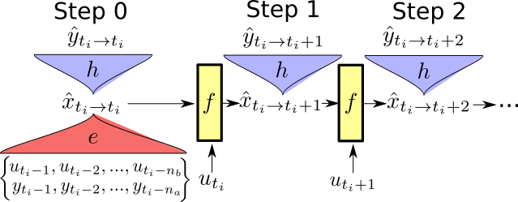

# State-space encoding applied on Wiener-Hammerstein and Silverbox benchmarks

The code from paper publish paper in L4DC 2021: https://arxiv.org/abs/2012.07697

The notebooks has been updated to be compatible with the newest version of [deepSI toolbox](https://github.com/GerbenBeintema/deepSI) (0.3.0).  

(original notebook available at: `6b531a1` with 0.1 version of deepSI)

# Instructions

* Get anaconda 3 (python>= 3.6)
* Install pytorch ([Instructions](https://pytorch.org/get-started) CUDA optional)
* Install [deepSI](https://github.com/GerbenBeintema/deepSI) (our preliminary toolbox)
  * `git clone git@github.com:GerbenBeintema/deepSI.git` 
  * `cd deepSI`
  * `pip install -e .`
  * or install directly using
  * `pip install git+git://github.com/GerbenBeintema/deepSI@master`
* install jupyter notebook 
  * (i.e. `conda install -c conda-forge jupyterlab`)
* Use jupyter notebooks to open notebooks.
  * (e.g. `jupyter notebook SS\ encoder\ Wiener-Hammerstein.ipynb`)

# State-space encoding structure

